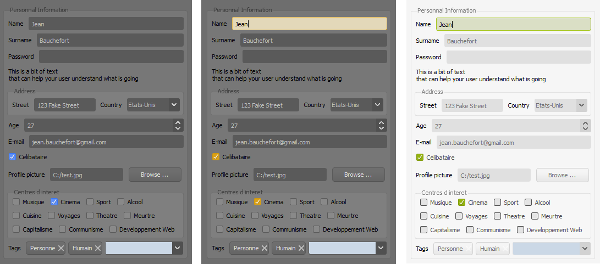
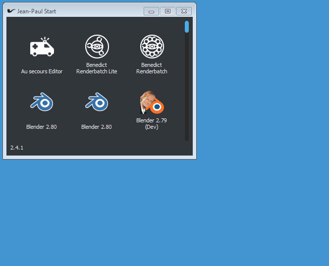
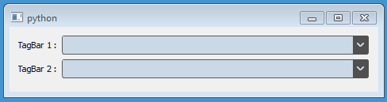
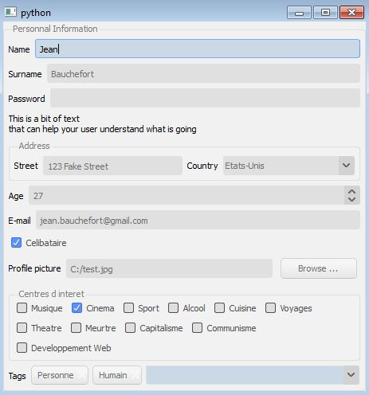

# GUI Bedos

PySide widgets and helpers

This project is used alongside [Qt.py](https://github.com/mottosso/Qt.py).

If you don't plan on using Qt.py, you must use PyQt5/PySide2 (`from Qt import QtWidgets`)

# CSS

## Themes

:warning: Themes will probably be deprecated in the near future :warning:

It is common to apply a custom CSS stylesheet to a QApplication.

This module allows to load 6 different themes, 
borrowed from the [FreeCAD project](https://github.com/FreeCAD/FreeCAD/tree/master/src/Gui/Stylesheets)

Stylesheets and icons are provided

Available themes are

- `dark-blue`
- `dark-green`
- `dark-orange`
- `light-blue`
- `light-green`
- `light-orange`

````python
from Qt.QtWidgets import QApplication, QPushButton
from guibedos import css

app = QApplication([])
css.set_theme(app, 'dark-blue')

button = QPushButton('Hello you')
button.show()

app.exec_()
````



### Custom stylesheets

You can add your custom stylesheets to the chosen theme by passing a list of stylesheets to the `set_theme()` method.

````python
custom_stylesheet_file_path = os.path.join(
    os.path.abspath((os.path.dirname(__file__))),
    'resources',
    'stylesheet.css'
).replace('\\', '/')

custom_stylesheet = open(custom_stylesheet_file_path).read()

css.set_theme(app, 'dark-blue', [custom_stylesheet])
````

## Editor

A small plain text editor with jinja2 capabilities is provided by the `guibedos.css.CSSEditor` class

It wraps the execution of `QApplication.exec_()` and 
dynamically applies the stylsheet to all the top level widgets (provided by `QApplication.topLevelWidgets()`) .

The project_name you give creates a folder in `~/CSSEditor/<project_name>`.

It contains

- `.csseditor` : window position and status oh the editor
- `theme.template` : the CSS template (lower part of the editor)
- `theme.variables` : the variables used for jinja2 templating, in JSON format
- `<project_name>.css` : the full stylesheet, this file is saved when the button "save" is pressed 

### Example

```python
import sys
from Qt import QtWidgets
from guibedos.css import CSSEditor


app = QApplication(sys.argv)

main_window = QtWidgets.QMainWindow()
main_window.show()

editor = CSSEditor(app=main_window, project_name='SomeName')
sys.exit(editor.exec_())
```

# Widgets

## FlowLayout

The "flow" layout is not available in native Qt.

Allows to layout in 2D a 1D array of widgets

_This widget was borrowed then adapted 
from [PySide Examples](https://github.com/PySide/Examples/blob/master/examples/layouts/flowlayout.py)_

````python
from Qt.QtWidgets import QPushButton
from guibedos.widgets import FlowLayout

layout = FlowLayout()
layout.addWidget(QPushButton('one'))
layout.addWidget(QPushButton('two'))
layout.addWidget(QPushButton('three'))
layout.addWidget(QPushButton('four'))
````



## TagBar

An augmented QLineEdit with buttons, allowing to edit a list of "tags"

 - Text + Button selection with `SHIFT` + `ARROW`
 - Copy/Paste
 - Clic on button removes it



_See `examples/tag-bar.py` in this repository_

## DeclarativeForm

The `DeclarativeForm` allows to generate widgets from a data structure of properties

Useful for asking the user a series of info without the hassle of manually creating the widgets



_See `examples/declarative-form.py` in this repository_

````python
from guibedos import declarative_form as df

property_ = df.Group('personal_info', caption="Personnal Information", properties=(
    df.Text('name', caption='Name', default='Jean'),
    df.Text('surname', caption='Surname', default='Bauchefort'),
    df.Text('password', caption='Password')
))
````

Calling `data()` on the widget returns a data structure reflecting property's structure, filled with user-entered values

````json
{
 "personal_info": {
  "name": "Jean",
  "surname": "Bauchefort",
  "password": ""
 }
}
````

### helpers

#### Hourglass

Context manager that freezes the widget and display a hourglass cursor

````python
import guibedos.helpers

class MyWidget(QtWidgets.QWidget):

    def __init__(self, parent=None):
        QWidgets.QWidget.__init_(self, parent)
       
    def lengthy_stuff():
        with guibedos.helpers.Hourglass(self):
            # do a lot of stuff
````

#### Update Combo

Updates a QComboBox items and tries to select previously selected item

If previously selected item was present, no QSignal is emitted

````python
import guibedos.helpers

guibedos.helpers.update_combo(some_qcombobox, ['some', 'items'])
````

## Blender

The module `blender` exposes a way to show QWidgets alongside Blender.

You will need a custom-compiled PySide build (compiled with the same compiler as Blender)

This modules groups and docks all widgets into a QMainWindow, and ensures that the QApplication is updated within 
blender's main loop.

**Do not use  `QApplication.exec_()`, as it is a synchronous call, and will freeze blender**

````python
import guibedos.blender
from some import SomeWidget

class SomeOperator(bpy.types.Operator):
    """
    Does something useful, with PySide
    """
    bl_idname = "cube.some"
    bl_label = "Some"

    def execute(self, context):
        self.report({'OPERATOR'}, 'bpy.ops.cube.some()')

        window = guibedos.blender.new_widget(SomeWidget)
        guibedos.blender.dock_to_main_window(window)

        return {'FINISHED'}

    def invoke(self, context, event):
        return self.execute(context)
````

## Notes

- CSS stylesheets and icons are borrowed from FreeCAD, more info 
[here](https://github.com/FreeCAD/FreeCAD/tree/master/src/Gui/Stylesheets)

- Some parts of this project are borrowed from GPLv2 licensed projects. If so, it is stated in the file
